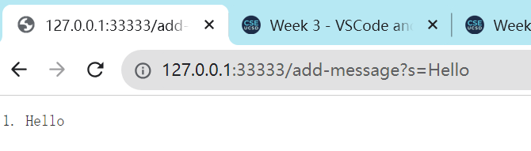
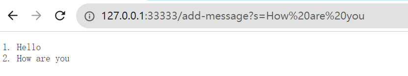
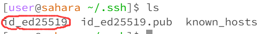
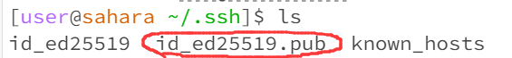
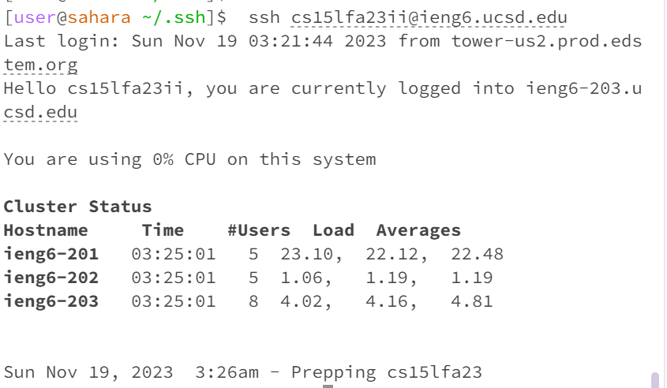

# Part1 StringServer
## 1.1 Code
```java

import java.io.IOException;
import java.net.URI;
import java.util.ArrayList;
import java.util.List;

class SEHandler implements URLHandler {
    // The one bit of state on the server: a number that will be manipulated by
    // various requests.
    List<String> table = new ArrayList<String>();

    public String handleRequest(URI url) {
        if (url.getPath().equals("/add-message")) {
            String[] parameters = url.getQuery().split("=");
            if (parameters[0].equals("s")) {
                String toAdd = parameters[1];
                add(toAdd);

                String str = "";
                for (int i = 0; i < table.size(); i ++) {
                    str += String.format("%d. %s\r\n", i+1, table.get(i));
                }

                return str;
            }
        } else if (url.getPath().equals("/search")) {
            String[] parameters = url.getQuery().split("=");
            if (parameters[0].equals("s")) {
                String toSearch = parameters[1];
                String ret = search(toSearch);
                if (ret.length() > 0) {
                    return String.format("search result:%s", ret);
                } else {
                    return String.format("search result: Nothing found");
                }
            }


        } else {

            return "404 Not Found!";
        }

        return "404 Not Found!";
    }

    private void add(String toAdd) {
        int ind = table.indexOf(toAdd);
        if (ind < 0) {
            table.add(toAdd);
        } else {
            ;
        }
    }

    private String search(String toSearch) {
        String ret = "";

        for (String elt : table) {
            if (elt.contains(toSearch)) {
                ret += elt + ";";
            }
        }

        return ret;
    }
}

class StringServer {
    public static void main(String[] args) throws IOException {
        if (args.length == 0) {
            System.out.println("Missing port number! Try any number between 1024 to 49151");
            return;
        }

        int port = Integer.parseInt(args[0]);

        Server.start(port, new SEHandler());
    }
}
```

## 1.2 Add Hello

1. `handleRequest()` is called and `URL(http://127.0.0.1:33333/add-message?s=Hello)` is the argument for this method. Then it will extract the word "Hello" and pass it to method `add()`
2. `add()` will add "hello" into the field `table` and return
3. `handleRequest()` will assemble all the words into a long string and return it to client.

## 1.3 Add "How are you"

1. `handleRequest()` is called and `URL(http://127.0.0.1:33333/add-message?s=How are you)` is the argument for this method. Then it will extract the word "How are you" and pass it to method `add()`
2. `add()` will add "hello" into the field `table` and return
3. `handleRequest()` will assemble all the words into a long string and return it to client.


# Part 2 
1. Local

2. Remote

3. Login without password


# Part 3
1. I learnt how to login "ieng6" system without entering password.
2. I learnt how to program a simple web server using JAVA, including how to parse the arguments from client browser and how to send simple response to client.

