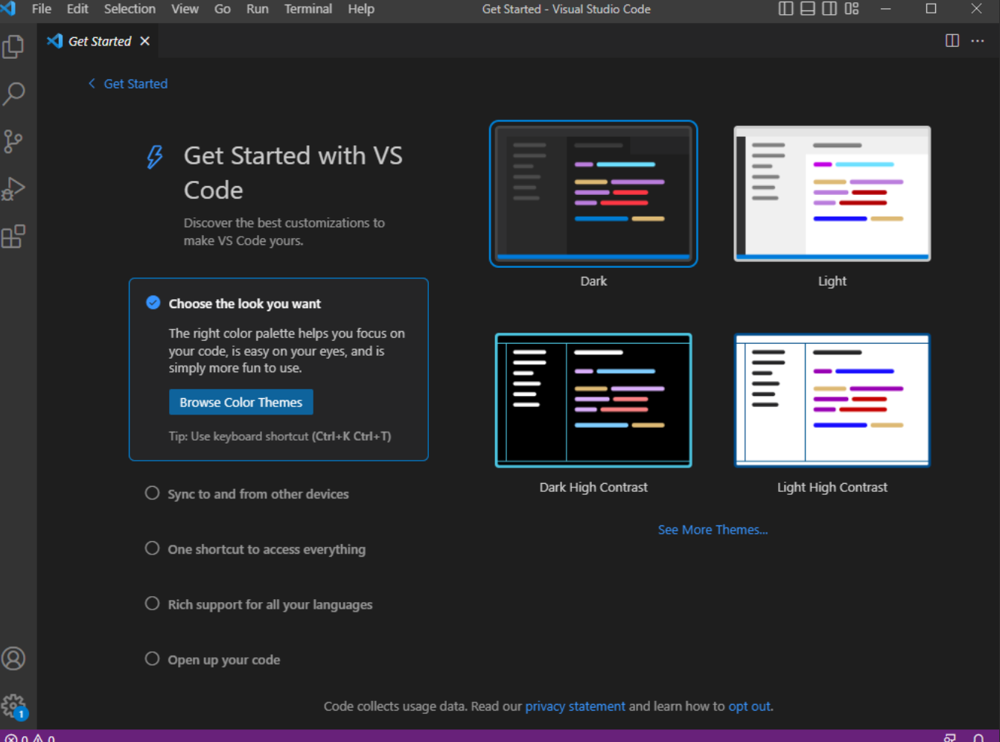
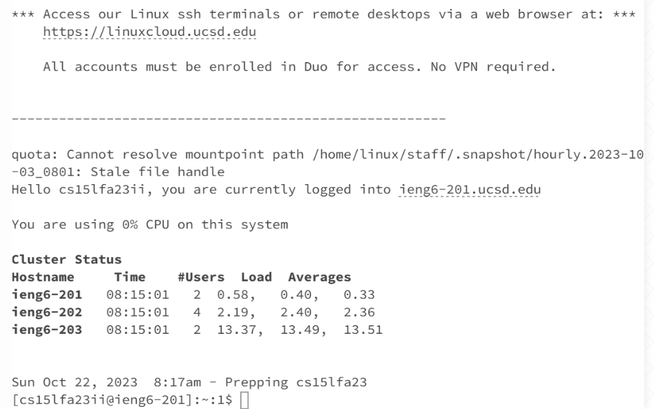
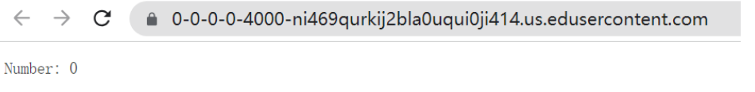
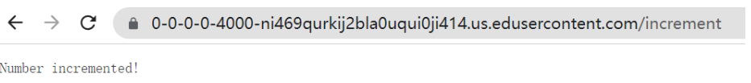
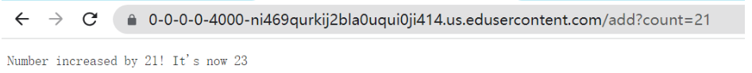
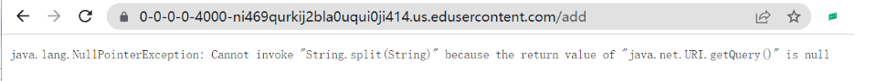

# Lab Report 1

## Part 1 – Meet Your Group!

I meet my 5 groupmembers! They all use their own computer, but I'm using school's computer.

## Part 2 – Your CSE15L Account

I created my account and transfer to CSE unique account, then reset password. I followed up the direction of [Link](https://drive.google.com/file/d/17IDZn8Qq7Q0RkYMxdiIR0o6HJ3B5YqSW/view), and use the [Link](https://sdacs.ucsd.edu/~icc/index.php) to enter the account.

## Part 3 – Visual Studio Code

I tried to installed the Visual Studio and GitBash. But since I'm using the school's computer I don't need to install it. I used [Link](https://code.visualstudio.com/) to download the Visual Studio and use [Link](https://gitforwindows.org/) to download the Git.

## Part 4 – Remotely Connecting

After running ssh, they asked me my password. In the beginning, I just copied and pasted my password, but it failed. Then I typed in the password more carefully and finally I  was able to login and got the following prompts.

## Part 5 – Building and Running the Server
### 5.1 Root

### 5.2 Increment

### 5.3 Add

### 5.4 Error

